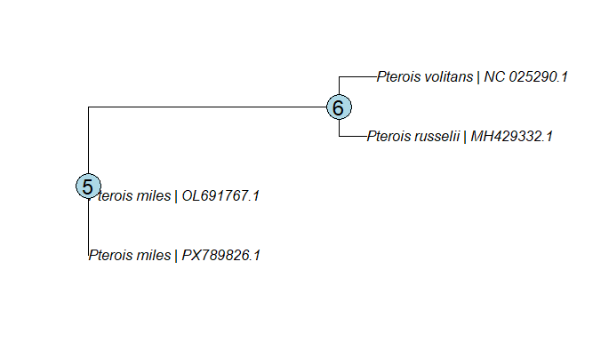

# In Silico Annotation and Comparative Analysis of the COX1 Gene in *Pterois miles*

**Author:** Beste Zorlu
**Affiliation:** Department of Biology & Aquatic Sciences and Engineering, Istanbul University
**Project type:** Educational / Open-source bioinformatics project

---

## Project Overview

This project presents an **in silico analysis of the mitochondrial cytochrome c oxidase subunit I (COX1/COI) gene** in lionfish species of the genus *Pterois*, with particular emphasis on *Pterois miles*.

The project was designed as a reproducible bioinformatics workflow beginning with publicly available nucleotide sequences and progressing through:

1. Sequence collection
2. Sequence quality control
3. Ambiguous nucleotide analysis
4. BLAST-based sequence identification
5. Multiple sequence alignment
6. Alignment quality control
7. Maximum-Likelihood phylogenetic analysis
8. Phylogenetic tree visualization and interpretation

All analyses were performed using publicly available sequence data and freely available bioinformatics software.

The project is intended primarily as an **educational bioinformatics workflow** demonstrating how a mitochondrial marker can be analyzed from raw nucleotide sequences to a preliminary phylogenetic interpretation.

---

# 1. Data Collection

COX1 nucleotide sequences were obtained from the **NCBI GenBank** database.

The initial *Pterois miles* dataset contained the following sequences:

| Accession  | Species         | Sequence length |
| ---------- | --------------- | --------------: |
| PX789826.1 | *Pterois miles* |          407 bp |
| OL691767.1 | *Pterois miles* |          589 bp |

Additional sequences were subsequently included for comparative and phylogenetic analysis:

| Accession   | Species            |
| ----------- | ------------------ |
| PX789826.1  | *Pterois miles*    |
| OL691767.1  | *Pterois miles*    |
| MH429332.1  | *Pterois russelii* |
| NC_025290.1 | *Pterois volitans* |

The final phylogenetic dataset therefore consisted of **four COX1 sequences representing three *Pterois* species**.

---

# 2. Sequence Quality Control

Basic sequence quality control was performed using **Python and Biopython**.

The QC analysis examined:

* Sequence length
* Nucleotide composition
* GC content
* Ambiguous nucleotide positions
* IUPAC ambiguity codes

The analysis script is stored in:

```text
scripts/qc_analysis.py
```

Example command:

```powershell
python scripts/qc_analysis.py
```

## Initial QC Results

| Sequence   | Length | GC content | Ambiguous bases |
| ---------- | -----: | ---------: | --------------: |
| PX789826.1 | 407 bp |     42.01% |              38 |
| OL691767.1 | 589 bp |     46.86% |               0 |

### PX789826.1

The PX789826.1 sequence was 407 bp long and had a GC content of 42.01%.

A total of **38 ambiguous nucleotide positions** were detected.

The observed IUPAC ambiguity codes included:

```text
R = A/G
K = G/T
Y = C/T
W = A/T
M = A/C
```

These ambiguous positions were not arbitrarily converted into a specific nucleotide.

### OL691767.1

OL691767.1 was 589 bp long and had a GC content of 46.86%.

No ambiguous nucleotide positions were detected.

---

# 3. Ambiguous Nucleotide Analysis

The ambiguous nucleotide positions in PX789826.1 were identified using Python.

The purpose of this analysis was to determine whether uncertainty in the original sequence could affect subsequent alignment and phylogenetic analyses.

Rather than replacing ambiguous nucleotides with arbitrary bases, the ambiguity information was retained during downstream processing.

---

# 4. Sequence Identification Using BLAST

The PX789826.1 sequence was compared against the NCBI nucleotide database using **BLAST**.

The BLAST analysis supported the identification of PX789826.1 as a partial mitochondrial **COX1 sequence of *Pterois miles***.

This step was used as a sequence identity verification step before comparative analysis.

The BLAST results were saved in:

```text
results/blast_results.txt
```

---

# 5. Multiple Sequence Alignment

Multiple sequence alignment was performed using **MAFFT v7.526**.

Four COX1 sequences were included:

* *Pterois miles* — PX789826.1
* *Pterois miles* — OL691767.1
* *Pterois russelii* — MH429332.1
* *Pterois volitans* — NC_025290.1

The final alignment contained:

* **4 sequences**
* **1551 aligned positions**
* **43 distinct patterns**
* **16 parsimony-informative sites**
* **14 singleton sites**
* **1521 constant sites**

The cleaned alignment used for phylogenetic analysis was:

```text
results/alignment/COX1_4species_aligned_clean.fasta
```

### MAFFT command

The alignment was generated using MAFFT.

Example reproducible command:

```powershell
mafft --auto input.fasta > results/alignment/COX1_4species_aligned.fasta
```

The resulting alignment was subsequently cleaned and prepared for downstream analysis.

---

# 6. Alignment Quality Control

Alignment quality was evaluated using Python and Biopython.

The analysis examined:

* Number of sequences
* Alignment length
* Number of gaps
* Number of ambiguous nucleotide positions

The QC script was:

```text
scripts/alignment_qc.py
```

Example command:

```powershell
python scripts/alignment_qc.py
```

## Alignment QC Results

| Sequence    | Gaps | Ambiguous bases |
| ----------- | ---: | --------------: |
| PX789826.1  | 1144 |              38 |
| OL691767.1  |  962 |               0 |
| MH429332.1  |  896 |               0 |
| NC_025290.1 |    0 |               0 |

The final alignment length was **1551 bp**.

A major limitation was identified during alignment QC:

> Three of the four sequences contained more than 50% gaps/ambiguity in the alignment.

This is largely associated with differences in sequence coverage and the use of partial COX1 sequences.

Therefore, the phylogenetic analysis should be considered a **preliminary COX1-based phylogenetic analysis** rather than a definitive species-level phylogeny.

---

# 7. Maximum-Likelihood Phylogenetic Analysis

Phylogenetic reconstruction was performed using **IQ-TREE v3.1.3**.

The analysis used:

* Maximum-Likelihood inference
* ModelFinder
* Bayesian Information Criterion (BIC) for model selection
* 1000 ultrafast bootstrap replicates
* 1000 SH-like approximate likelihood ratio test replicates

## IQ-TREE command

The final analysis was performed using:

```powershell
& "C:\Users\asus\Downloads\iqtree-3.1.3-Windows\iqtree-3.1.3-Windows\bin\iqtree3.exe" -s "results\alignment\COX1_4species_aligned_clean.fasta" -m MFP -bb 1000 -alrt 1000 -nt AUTO -redo -pre "results\phylogeny\COX1_tree"
```

### Explanation of the command

```text
-s
```

Specifies the input alignment.

```text
-m MFP
```

Uses ModelFinder to identify an appropriate substitution model.

```text
-bb 1000
```

Performs 1000 ultrafast bootstrap replicates.

```text
-alrt 1000
```

Performs 1000 SH-like aLRT replicates.

```text
-nt AUTO
```

Allows IQ-TREE to determine the appropriate number of CPU threads.

```text
-redo
```

Forces IQ-TREE to rerun the analysis when previous output files already exist.

```text
-pre
```

Defines the output file prefix.

---

# 8. Model Selection

ModelFinder evaluated multiple nucleotide substitution models.

According to the **Bayesian Information Criterion (BIC)**, the best-fitting model was:

```text
HKY+F
```

The model selected according to AIC was:

```text
HKY+F+I
```

However, because BIC was used as the primary model-selection criterion, **HKY+F** was used for the final phylogenetic analysis.

---

# 9. Phylogenetic Results

The Maximum-Likelihood tree produced by IQ-TREE was:

```text
(PX789826.1:0.0000010014,
 OL691767.1:0.0000022637,
 (MH429332.1:0.0045709101,
  NC_025290.1_5492-7042:0.0062837610)100/100:0.0423795596);
```

The corresponding topology can be summarized as:

```text
             ┌── PX789826.1 (*Pterois miles*)
─────────────┤
             └── OL691767.1 (*Pterois miles*)

             ┌── MH429332.1 (*Pterois russelii*)
─────────────┤
             │
             └── NC_025290.1 (*Pterois volitans*)
```

The internal branch separating *P. russelii* and *P. volitans* received:

```text
SH-aLRT = 100
UFBoot  = 100
```

---

# 10. Interpretation of the Phylogenetic Tree

The reconstructed Maximum-Likelihood tree indicates that the two *Pterois miles* sequences, PX789826.1 and OL691767.1, occupy closely related positions in the COX1 dataset.

The *Pterois russelii* and *Pterois volitans* sequences form a separate supported lineage in the reconstructed tree.

The internal node connecting *P. russelii* and *P. volitans* received **100 SH-aLRT and 100 ultrafast bootstrap support**, indicating strong support for this particular split under the selected analytical framework.

However, the tree should not be interpreted as definitive evidence of complete evolutionary relationships among the three species.

The alignment contained a high proportion of gaps for three sequences. In particular, PX789826.1 represents a relatively short partial sequence, while the reference mitochondrial sequence represented by NC_025290.1 provides substantially greater sequence coverage.

Consequently, differences in sequence coverage may influence the inferred topology.

The result is therefore best described as a:

> **Preliminary COX1-based Maximum-Likelihood phylogenetic reconstruction of selected *Pterois* sequences.**

Future analyses using longer homologous COX1 regions, additional specimens, and additional mitochondrial or nuclear markers would provide a stronger basis for phylogenetic inference.

---

# 11. Phylogenetic Support Values

The tree was generated using two complementary branch-support approaches:

### Ultrafast Bootstrap

```text
1000 replicates
```

Ultrafast bootstrap values provide an estimate of the consistency of inferred branches across resampled datasets.

### SH-like aLRT

```text
1000 replicates
```

The SH-like approximate likelihood ratio test evaluates support for individual branches based on likelihood-based comparisons.

The resulting branch support was reported by IQ-TREE in the tree file.

For example:

```text
100/100
```

indicates:

```text
SH-aLRT / Ultrafast Bootstrap
```

for the corresponding branch.

---

# 12. Branch Lengths and Scale

The tree contains branch lengths representing estimated evolutionary change under the selected substitution model.

For example:

```text
MH429332.1:0.0045709101
NC_025290.1:0.0062837610
```

The branch length is not a measure of geographic distance or physical distance between species.

Instead, it represents the estimated amount of nucleotide substitution per site under the phylogenetic model.

When the tree is visualized, a scale bar should therefore be interpreted as:

> **Substitutions per site**

rather than kilometers, years, or percentage similarity.

---

# 13. Phylogenetic Output Files

IQ-TREE generated the following files:

```text
results/
└── phylogeny/
    ├── COX1_tree.bionj
    ├── COX1_tree.ckp.gz
    ├── COX1_tree.contree
    ├── COX1_tree.iqtree
    ├── COX1_tree.log
    ├── COX1_tree.mldist
    ├── COX1_tree.model.gz
    ├── COX1_tree.splits.nex
    └── COX1_tree.treefile
```

Important files include:

| File                   | Description                        |
| ---------------------- | ---------------------------------- |
| `COX1_tree.treefile`   | Maximum-Likelihood tree            |
| `COX1_tree.contree`    | Bootstrap consensus tree           |
| `COX1_tree.iqtree`     | Complete IQ-TREE analysis report   |
| `COX1_tree.splits.nex` | Branch support information         |
| `COX1_tree.mldist`     | Maximum-Likelihood distance matrix |
| `COX1_tree.log`        | Analysis log                       |
| `COX1_tree.bionj`      | BioNJ starting tree                |
| `COX1_tree.model.gz`   | ModelFinder information            |
| `COX1_tree.ckp.gz`     | IQ-TREE checkpoint file            |

---

## Phylogenetic Tree Visualization

The Maximum-Likelihood phylogenetic tree was visualized in R using the `ape` package.

The figure displays:

- *Pterois* species names in italics
- NCBI accession numbers
- Internal node positions
- SH-aLRT / ultrafast bootstrap support
- Branch lengths
- A scale bar representing substitutions per site

## Phylogenetic Tree Visualization



**Figure 1.** Maximum-Likelihood phylogenetic tree reconstructed from COX1 sequences of four *Pterois* specimens representing three species. The tree was inferred using IQ-TREE v3.1.3 under the HKY+F model selected by ModelFinder according to BIC, with 1000 ultrafast bootstrap and 1000 SH-aLRT replicates. The scale bar represents nucleotide substitutions per site. The *Pterois miles* sequences cluster together, while *Pterois russelii* and *Pterois volitans* form a separate group. The internal branch connecting *P. russelii* and *P. volitans* received 100/100 support. Due to substantial differences in sequence coverage and the high proportion of gaps in several sequences, this topology should be considered a preliminary COX1-based phylogenetic reconstruction.
**Figure 1.** Maximum-Likelihood phylogenetic tree reconstructed from COX1 nucleotide sequences of four *Pterois* specimens representing three species. The tree was inferred using IQ-TREE v3.1.3 under the HKY+F model selected by ModelFinder according to BIC, with 1000 ultrafast bootstrap and 1000 SH-aLRT replicates. The scale bar represents nucleotide substitutions per site. The two *Pterois miles* sequences cluster together, while *P. russelii* and *P. volitans* form a separate supported group. The internal branch connecting *P. russelii* and *P. volitans* received 100/100 support. Due to substantial differences in sequence coverage and the high proportion of gaps in several sequences, this topology should be considered a preliminary COX1-based phylogenetic reconstruction.

# 14. Reproducibility

The complete workflow can be reproduced using the following general pipeline:

```text
NCBI GenBank
     │
     ▼
FASTA sequences
     │
     ▼
Sequence QC
(Python / Biopython)
     │
     ▼
BLAST identification
     │
     ▼
MAFFT alignment
     │
     ▼
Alignment QC
(Python / Biopython)
     │
     ▼
IQ-TREE
     │
     ├── ModelFinder
     ├── Maximum Likelihood
     ├── UFBoot 1000
     └── SH-aLRT 1000
     │
     ▼
Phylogenetic tree
     │
     ▼
Tree visualization
```

---

# 15. Software and Tools

The project used the following software and resources:

* **NCBI GenBank** — nucleotide sequence database
* **NCBI BLAST** — sequence similarity and identification
* **Python 3.13** — sequence analysis
* **Biopython** — biological sequence processing
* **MAFFT v7.526** — multiple sequence alignment
* **IQ-TREE v3.1.3** — Maximum-Likelihood phylogenetic inference
* **FigTree** — tree visualization and graphical editing
* **GitHub** — project documentation and version control

---

# 16. Project Structure

```text
Pterois-Miles-COX1-Annotation/
│
├── data/
│   ├── raw/
│   │   ├── Pterois_miles.fasta
│   │   ├── Pterois_russelii.fasta
│   │   └── Pterois_volitans.fasta
│   │
│   └── processed/
│
├── results/
│   ├── alignment/
│   │   ├── COX1_aligned.fasta
│   │   ├── COX1_aligned_clean.fasta
│   │   ├── COX1_4species_aligned.fasta
│   │   ├── COX1_4species_aligned_clean.fasta
│   │   └── COX1_4species_qc_temp.fasta
│   │
│   ├── phylogeny/
│   │   ├── COX1_tree.treefile
│   │   ├── COX1_tree.contree
│   │   ├── COX1_tree.iqtree
│   │   ├── COX1_tree.splits.nex
│   │   ├── COX1_tree.mldist
│   │   ├── COX1_tree.log
│   │   └── COX1_tree.model.gz
│   │
│   ├── blast_results.txt
│   ├── qc_report.txt
│   └── alignment_qc_report.txt
│
├── scripts/
│   ├── qc_analysis.py
│   └── alignment_qc.py
│
├── figures/
│   └── COX1_Pterois_phylogenetic_tree.png
│
└── README.md
```

---

# 17. Limitations

Several limitations should be considered when interpreting the results.

### 17.1 Unequal sequence coverage

The four sequences differ considerably in their available sequence coverage.

Three sequences contained more than 50% gaps/ambiguity in the final alignment.

### 17.2 Partial sequence data

PX789826.1 is a relatively short partial COX1 sequence.

Consequently, the sequence may provide less phylogenetic information than a complete or longer homologous COX1 region.

### 17.3 Limited taxon sampling

Only four sequences representing three *Pterois* species were analyzed.

A larger dataset containing more individuals and species would provide a more robust assessment of relationships within the genus.

### 17.4 Single-marker analysis

The analysis is based only on the mitochondrial COX1 marker.

Phylogenetic inference based on multiple mitochondrial and/or nuclear markers would provide stronger evolutionary evidence.

---

# 18. Conclusion

This project demonstrates a complete introductory bioinformatics workflow for analyzing COX1 sequences from *Pterois* species.

The workflow progressed from sequence acquisition and quality control to BLAST-based identification, multiple sequence alignment, alignment QC, and Maximum-Likelihood phylogenetic reconstruction.

The final phylogenetic analysis identified a strongly supported branch separating the *Pterois russelii* and *Pterois volitans* sequences, with **100 SH-aLRT and 100 ultrafast bootstrap support**.

The two *Pterois miles* sequences were positioned together in the reconstructed topology.

However, because of substantial differences in sequence coverage and the high proportion of gaps in several sequences, the tree should be considered **preliminary**.

The project provides a reproducible foundation that can be expanded by adding:

* More *Pterois* species
* More individuals per species
* Complete COX1 sequences
* Additional mitochondrial markers
* Nuclear markers
* Genetic distance analyses
* Haplotype analysis
* Bayesian phylogenetic inference
* Species delimitation analyses

---

# 19. Citation

If this project or its workflow is referenced in academic work, please cite the project as:

**Zorlu, B.** *In Silico Annotation and Comparative Analysis of the COX1 Gene in Pterois miles*. GitHub repository, 2026.

Suggested in-text citation:

```text
(Zorlu, 2026)
```

or:

```text
Zorlu (2026)
```

---

# Author

**Beste Zorlu**

Department of Biology & Aquatic Sciences and Engineering
Istanbul University

---

## Project Status

**Current status:** Completed preliminary COX1 sequence analysis and phylogenetic reconstruction.

**Current version:** v1.0

The project is intended to serve as an educational and reproducible example of a basic molecular bioinformatics workflow.

